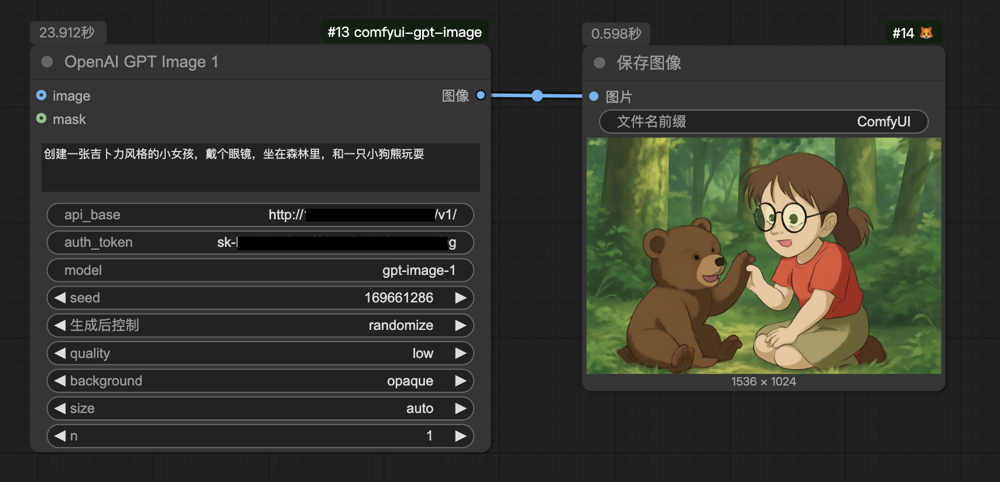
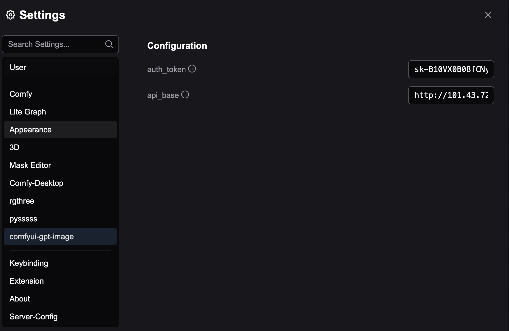

## comfyui-gpt-image

`comfyui-gpt-image` ports the official ComfyUI GPT-API node, adding support for customizable `api_base`, `auth_token`, and `model` settings.

### Features
- 🎸 Support config auth_token, base_url in ComfyUI Settings(^1.2.0),
- 🎸 Configure custom API endpoints (`api_base`)
- 🎸 Support for authentication tokens (`auth_token`)
- 🎸 Easily specify different GPT models (`model`)
- 🎸 Seamless integration with ComfyUI

### Requirements

- Python 3.10+
- ComfyUI (latest version recommended)

### Installation

Clone the repository into ComfyUI's custom_nodes directory:

```bash
cd ComfyUI/custom_nodes

git clone https://github.com/lceric/comfyui-gpt-image
```

Install the required Python dependencies:

```bash
cd comfyui-gpt-image

pip install -r requirements.txt
```

Restart ComfyUI. The new GPT node will be automatically loaded and available for use.

### Preview

Here’s a quick look at the GPT-API node inside ComfyUI:

**生成图片**



**编辑图片**


### Usage

After restarting ComfyUI:

- Locate the GPT-API node in the node list.
- Configure your `api_base`, `auth_token`, and `model` parameters as needed.
- Connect it to your workflow and start generating content with GPT!

In `v1.2.0`, support configure `api_base`, `auth_token` in the comfyui settings, as shown below:



> The configuration in the workflow node is used first. If it is empty, the ComfiyUI configuration is used.

| Parameter   | Description                                           |
|-------------|-------------------------------------------------------|
| api_base    | Base URL of your GPT API endpoint.                   |
| auth_token  | Authentication token for secured API access.         |
| model       | Model name to be used (e.g., `gpt-image-1`, `gpt-image-1-all`). |

### Troubleshooting

Node not showing up?
Make sure you installed all dependencies and restarted ComfyUI.

### API errors?

Double-check your api_base, auth_token, and model values.

### License

This project is licensed under the MIT License.

### Acknowledgements

[ComfyUI](https://www.comfy.org/zh-cn/) - Powerful node-based UI for generative AI.

Thanks to the ComfyUI community for inspiration and support!
